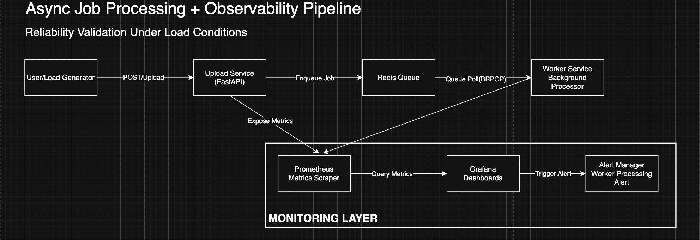
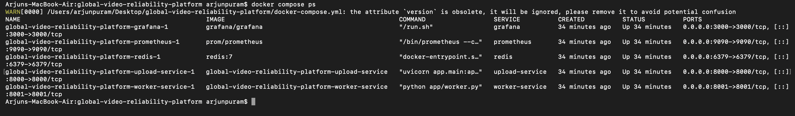
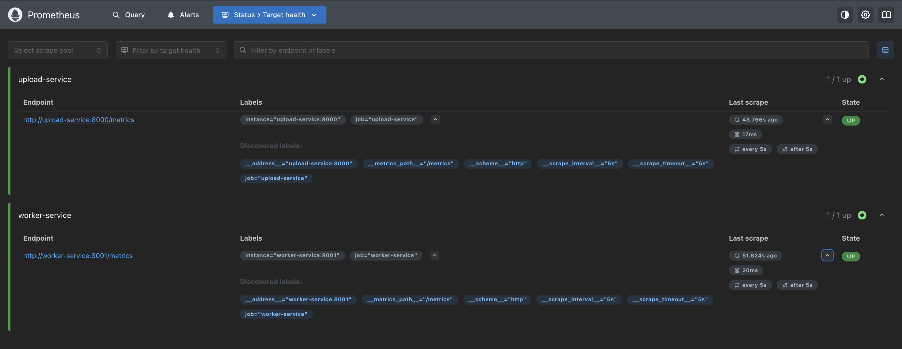
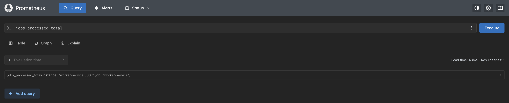
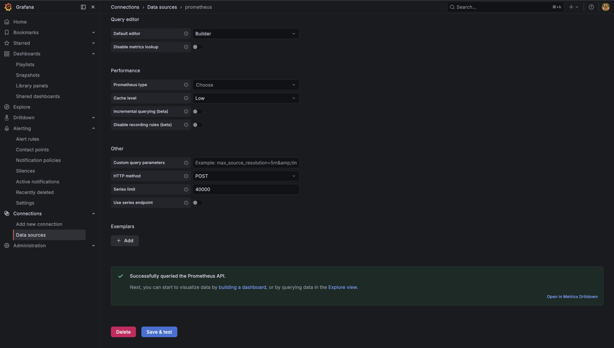
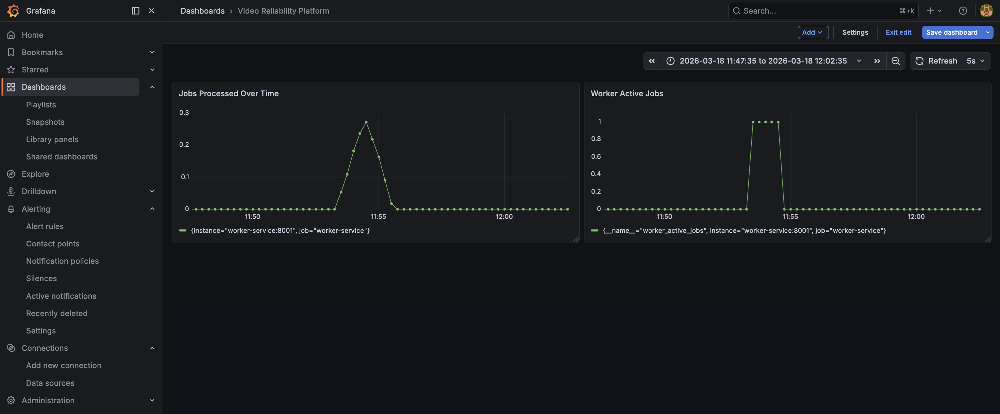
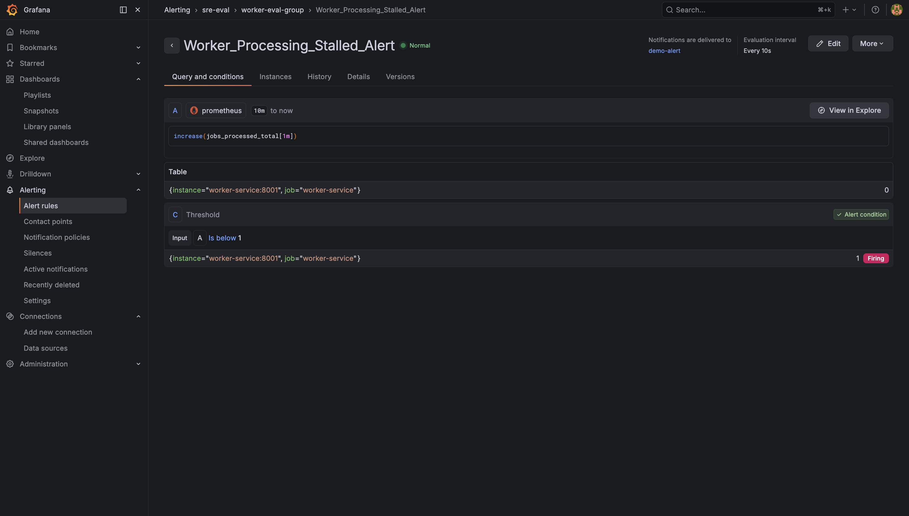
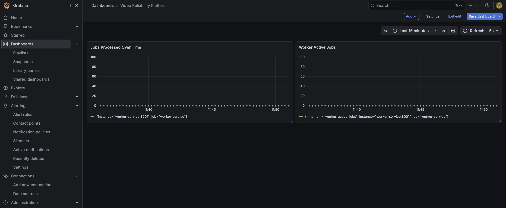
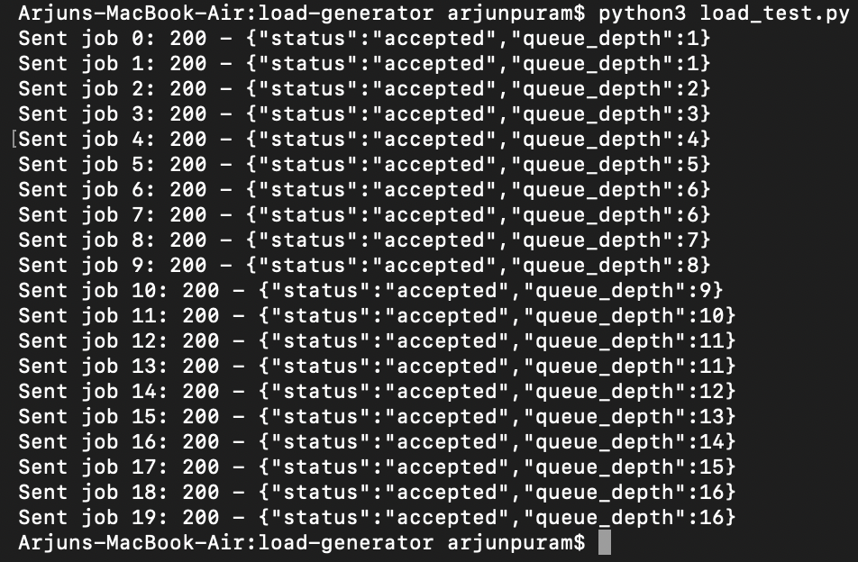
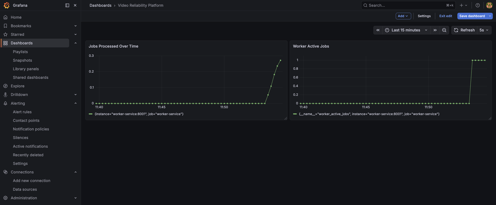

# Global Video Reliability Platform - SRE Monitoring Project

## Project Overview

This project demonstrates how a distributed video processing system can be monitored and validated using modern Site Reliability Engineering (SRE) practices.

The goal was to simulate a real production-like workflow where video processing jobs are submitted, queued, processed by background workers, and continuously monitored for performance and reliability issues.

This project focuses not only on building services but also on **observing system behavior under load and detecting failure conditions early.**

---

## Problem Statement

Modern video platforms process large volumes of background jobs such as video uploads, transcoding, and metadata processing.

During sudden traffic spikes, queues can grow rapidly and worker failures may go unnoticed without proper monitoring.

This project demonstrates how monitoring dashboards, alerting mechanisms, and controlled load testing can help engineers understand system behavior and ensure reliability under varying workload conditions.

---

## System Architecture



The platform consists of the following core components:

- **Upload Service** - Receives incoming job requests and pushes them into the queue  
- **Worker Service** - Processes queued jobs asynchronously in the background  
- **Redis** - Acts as the job queue backend enabling decoupled processing  
- **Prometheus** - Collects and stores system performance metrics  
- **Grafana** - Provides visualization dashboards and alerting capabilities  
- **Load Generator** - Simulates traffic spikes and stress conditions  

This architecture represents a simplified version of asynchronous background processing pipelines used in large-scale video processing platforms.

---

## Processing Flow

1. Client sends upload request to the Upload Service  
2. Job is enqueued into Redis queue  
3. Worker Service continuously polls and processes jobs  
4. Prometheus scrapes metrics exposed by services  
5. Grafana visualizes system workload and health trends  
6. Alerts are triggered if worker processing stalls or queue backlog increases

---

## Tech Stack

- Python (FastAPI) for backend services
- Redis for asynchronous job queueing
- Prometheus for metrics collection and monitoring
- Grafana for visualization dashboards and alerting
- Docker & Docker Compose for containerized deployment
- Custom Python load generator for traffic simulation

---

## ⚙️ How to Run the Project

### Step 1 - Start All Services

From the project root directory:

```bash
docker compose up --build
```

---

### Step 2 - Verify Containers Are Running

Open a **new terminal window** and run:

```bash
docker compose ps
```

📸 Screenshot:



---

### Step 3 - Verify Prometheus Targets

Open Prometheus in your browser:

http://localhost:9090

From the top menu go to:

Status → Targets

Verify that both services are in **UP** state:

- upload-service
- worker-service

This confirms Prometheus is successfully scraping metrics.

📸 Screenshot:



---

### Step 4 - Verify Worker Metrics in Prometheus

In Prometheus UI go to:

Graph → Enter Query:

jobs_processed_total

Click **Execute**.

You should see metric values plotted.  
This confirms worker metrics are being collected.

📸 Screenshot:



---

### Step 5 - Configure Grafana Data Source

Open Grafana:

http://localhost:3000

Login:

- Username: admin  
- Password: admin  

Navigate to:

Connections → Data Sources → Add Data Source → Prometheus

Set URL:

http://prometheus:9090

Click **Save & Test**.  
You should see **Data source is working**.

📸 Screenshot:



---

### Step 6 - Open Monitoring Dashboard

Open the Grafana dashboard and verify that both monitoring panels are available:

- Jobs Processed Over Time
- Worker Active Jobs

This dashboard provides visibility into worker throughput and queue processing activity.

📸 Screenshot:



---

### Step 7 - Validate Alert Firing

Create an alert rule to detect unexpected drops in worker processing activity during active workload.

Set the evaluation window to **1 minute**.

When the worker stops processing jobs, the alert should move to **FIRING** state.

📸 Screenshot:



---

### Step 8 - Observe System Before Load

Open Grafana Dashboard:

http://localhost:3000

Observe system metrics when there is **no traffic**.

You will notice:

- Jobs Processed metric is flat or near zero  
- Worker Active Jobs is zero  
- System is stable  

This represents the **baseline system state**.

📸 Screenshot:



---

### Step 9 - Run Load Generator

Open a new terminal and run:

```bash
cd load-generator
python3 load_test.py
```
This script sends multiple job requests and increases queue depth, simulating a traffic spike scenario.
📸 Screenshot:



---

### Step 10 - Observe Metrics During Load Spike

While the load generator script is running, open the Grafana dashboard again:

http://localhost:3000

Refresh the dashboard.

You will notice:

- Jobs Processed metric increasing continuously  
- Worker Active Jobs rising due to queued workload  
- Clear spike pattern visible in the time-series graphs  

This confirms that the system is **actively processing traffic and handling increased load.**

📸 Screenshot:



---

### Step 11 - Observe System Recovery After Load

After the load generator finishes sending requests, refresh the Grafana dashboard again.

You will observe:

- Worker Active Jobs gradually returning to zero  
- Queue backlog getting cleared  
- Metrics stabilizing back to normal levels  

This demonstrates **system recovery behavior after a traffic spike**, which is a key reliability indicator.

📸 Screenshot:


---

### Step 12 - Reliability Observation Summary

At this stage, the system behavior has been validated across three important conditions:

- Idle system state (baseline)
- Load spike during traffic simulation
- System recovery after workload completion

These observations confirm that:

- Background workers process jobs asynchronously  
- Queue backlog grows during spikes  
- Monitoring dashboards reflect real-time workload changes  
- System stabilizes automatically after traffic reduces  

This demonstrates core Site Reliability Engineering concepts such as **observability, load handling, and recovery validation.**

---

### Step 13 - Stop the Monitoring Stack

After completing the testing cycle, stop all running services.

Run:

```bash
docker compose down
```

---

### Step 14 - Restart the Monitoring Stack (Reproducibility Test)

To validate that the entire monitoring environment can be redeployed consistently, restart all services.

From the project root directory run:

```bash
docker compose up -d --build
```

---

### Step 15 - Final System Health Verification

As a final validation step, confirm that all monitoring and application services are running successfully.

Open a **new terminal window** and run:

```bash
docker compose ps
```

---

## 🎯 Key Takeaways

This project demonstrates how system reliability can be validated using monitoring, alerting, and load simulation techniques.

It highlights the importance of observing system behavior during traffic spikes, detecting failures early through alerts, and confirming recovery after workload stabilization.

---

## 🚀 Future Scope

This platform can be further improved by introducing worker auto-scaling, Kubernetes deployment, and distributed tracing for deeper observability.

Additional enhancements such as automated alert notifications, load balancing strategies, rate limiting, and chaos testing can help validate resilience under unexpected failure scenarios.

These improvements would make the system closer to real production reliability standards used in large-scale video processing platforms.

---
